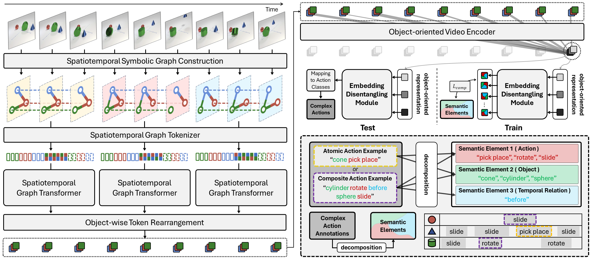

# Spatiotemporal Graph Transformer(STGT)

> This is an official PyTorch Implementation of **Compositional Video Understanding with Spatiotemporal Structure-based Transformers (CVPR 2024)** [Paper Link](https://openaccess.thecvf.com/content/CVPR2024/html/Yun_Compositional_Video_Understanding_with_Spatiotemporal_Structure-based_Transformers_CVPR_2024_paper.html)



## 1. Environmental Setup

The environments we have tested are as follows:
> Ubuntu 20.04 | CUDA 11.7 | Python 3.8.17 | Pytorch 1.13.1 | torchvision 0.14.1

#### 1-1. Using the provided env.yaml and conda
<pre>
<code>conda env create --file env.yaml
conda activate STGT</code>
</pre>

#### 1-2. Using the provided Docker image
<pre>
<code># will be updated soon</code>
</pre>

## 2. Data Preparation

Designed data folder structure is as follows:
<br>
<pre>
<code>root_dir
└── data
    ├── cater
    │   ├── graph
    │   ├── preproc
    │   │   ├── dof
    │   │   ├── feature
    │   │   ├── metadata
    │   │   └── target
    │   ├── raw
    │   └── splits
    └── moma
        ├── graph
        ├── preproc
        │   ├── bbox
        │   ├── feature
        │   ├── metadata
        │   └── target
        ├── raw
        └── splits
</code>
</pre>


Through the script below, you can download the preprocessed data that we have prepared (2-1). In the future, we will provide code (2-2) to generate preprocessed data from the raw data.


#### 2-1. Download Preprocessed Data
<pre>
<code>cd &lt;root_dir&gt;
bash download.sh</code>
</pre>


#### 2-2. Graph Construction & Data Preprocessing
<pre>
<code># will be updated soon</code>
</pre>


## 3. Citation
```
@inproceedings{yun2024compositional,
  title={Compositional Video Understanding with Spatiotemporal Structure-based Transformers},
  author={Yun, Hoyeoung and Ahn, Jinwoo and Kim, Minseo and Kim, Eun-Sol},
  booktitle={Proceedings of the IEEE/CVF Conference on Computer Vision and Pattern Recognition},
  pages={18751--18760},
  year={2024}
}
```

## 4. Acknowledgements
This work is supported by IITP grant funded by MSIT (Grant No. 2022-0-00264/40%, 2022-0-00612/20%, 2022-0- 00951/20%,) and IITP Artificial Intelligence Graduate School Program for Hanyang University funded by MSIT (Grant No. RS-2020-II201373/20%).